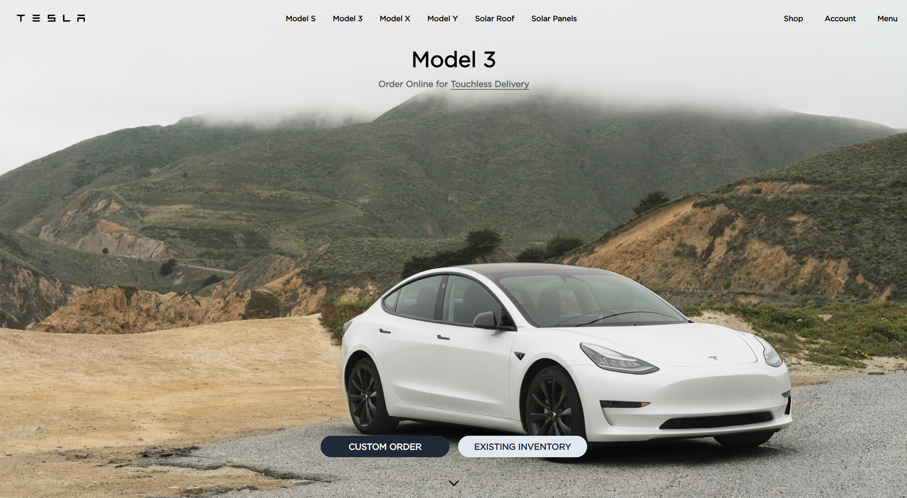

# Tesla Landing Page (Tailwind CSS)

A simple Tesla-inspired landing page built with HTML and Tailwind CSS v4.

## 🚀 Live Demo

👉 [https://react-shop-cart-navy.vercel.app/](https://tesla-tailwind-landing-page.vercel.app/)

## Tech Stack

- HTML5
- Tailwind CSS v4 (`@tailwindcss/cli`)
- PostCSS + Autoprefixer (installed as dev dependencies)

## Project Structure

- `src/index.html` - main page markup
- `src/input.css` - Tailwind import and custom global styles
- `src/output.css` - generated Tailwind output file
- `tailwind.config.js` - content scanning configuration

## Getting Started

### 1) Clone the repository

```bash
git clone https://github.com/vasylpryimakdev/tesla-tailwind-landing-page.git
cd tesla-tailwind-landing-page
```

### 2) Install dependencies

```bash
npm install
```

### 3) Build CSS once

```bash
npm run build:css
```

### 4) Watch CSS during development

```bash
npm run watch:css
```

Then open `src/index.html` in your browser.

## Available Scripts

- `npm run build:css` - builds and minifies `src/output.css`
- `npm run watch:css` - rebuilds `src/output.css` on file changes

## Screenshots

### Preview

| Home |
| --- |
|  |

## Notes

- The page uses external image URLs (Unsplash) for section backgrounds.
- Custom font is loaded from `public/GothamBook.ttf` in `src/input.css`.
